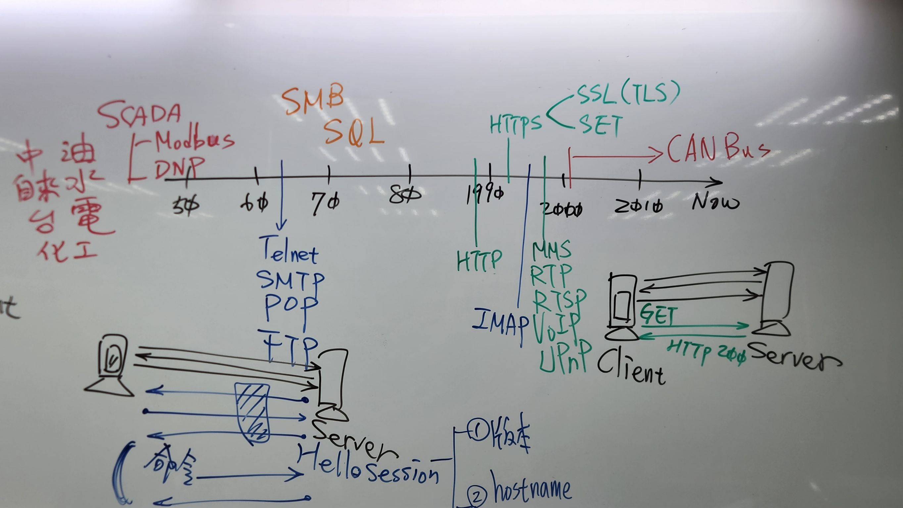

Packet Analysis
===
🔙 [HOME](../../HOME.md)


# Introduciton
為什麼要學習封包分析
- 弱點掃描是一個非常差勁政策，弱點掃描的本質是在**找尋已知漏洞，**滲透測試的本質是在**找尋未知漏洞**
- [遠東銀行事件惡意程式分析](https://blogs.longwin.com.tw/wordpress/201710-TWCERTCC-MIFR.pdf) (關鍵字 : 2017、FEIB、駭客、金額、PDF)
  - TWCERT在台灣算半官方的單位，所以該份報告具有一定的可信度
  - 早在104年開始金管會就規定金融單位，每季應進行弱點掃描，並針對其掃描或測試結果進行風險評估，同時也有密碼相關的規定([電子支付機構資訊系統標準及安全控管作業基準辦法](https://law.fsc.gov.tw/LawContent.aspx?id=GL001541))
  - 也就是說所有花錢能安裝的能買的，IPS、FW、防毒軟體，全部都已被銀行部屬，但事實是**駭客成功入侵銀行並且潛伏長達一年，這一年銀行進行過至少四次的弱掃**，卻沒有發現問題
  - 那為什麼還會被入侵，分析有以下兩種可能
    1. 各單位作的弱點掃描都只是虛應了事，如果是這樣的調查結果，那相關的遠東、馬偕、彰基的入侵事件，各單位都應該被受罰，但是事實是並沒有
    2. 剩下的可能就是，**<font color="red">現行的弱點掃描檢測對於資安是沒有用的</font>**
- 學習病毒封包分析的三大精神
  - 不要怕駭客 (再厲害都是人都是來上CEH，只是誰比較熟而已)
  - 不要怕病毒 (再厲害的病毒、勒索軟體，說到底都只是程式碼)
  - 不要怕資安事件 (冷靜應對步步為營，不要害怕做決定，最怕人猶豫不決)

# Malware Sample
- [MalwareBazaar](https://bazaar.abuse.ch/)
  - 瑞士資安組織 abuse.ch 所維護的一個全球性惡意軟體樣本分享平台
  - 每筆樣本附有惡意軟體家族分類、上傳時間與來源資訊
  - 支援 API 與自動化分析整合
- [VirusTotal](https://www.virustotal.com/)
  - Google 擁有的一個免費線上惡意檔案與網址掃描平台
  - 支援超過 70 種防毒引擎的掃描結果（如 Kaspersky、Symantec、TrendMicro 等）
  - 支援網址與 IP 檢測、YARA 規則搜尋與 API 整合
- 從 MalwareBazaar 複製某個惡意樣本的 Hash（例如 MD5、SHA256），然後貼到 VirusTotal 上查詢，就能看到該檔案目前被哪些防毒軟體偵測為惡意，哪些沒有偵測出來
  - 分析哪些新興惡意程式尚未被傳統防毒辨識
  - 分析各家防毒引擎的更新與偵測能力差異
  - 可以觀察到很多病毒其實防毒軟體都找不出來
- 也可以將樣本產出Hash之上傳到Virus Total進行分析
    ```bash
    certutil -hashfile dwm.exe MD5
    ```

# Wireshark Basic
## Configuration
View 
```bash
Open [ Packet Details ]
Open [ Packet Bytes ]
```

## Packet Color
錄完封包後首先我們先看右邊的封包顏色進行初步的分析
| 顏色 | 說明 |
|------|------|
| ⚪ 白色 | 一般封包，常見於第二層 Ethernet 封包，未套用特定協定色彩規則。 |
| 🔵 淺藍色 | UDP 封包，如 DNS、DHCP、mDNS 等。 |
| 🟣 藍紫色 | TLS/SSL 加密封包，內容加密，在沒有工具的前提下也無法直接解讀。 |
| 🟢 綠色 | HTTP 封包（明文傳輸），可直接觀察 GET/POST 等內容。 |
| 🔴 紅色 | 錯誤或異常封包，如 TCP RST（強制斷線）、TCP Retransmission（重傳）。 |
| 🟡 淺黃色 | NetBIOS Name Service，網路芳鄰相關封包。 |
| 🟧 鵝黃色（深黃偏橘） | ARP 封包（Address Resolution Protocol），區域網路內查詢/回應。 |
| ⚫ 黑底白字 | 傳輸異常封包，因TCP Flow Control，如 `TCP Dup ACK`、`ZeroWindow`、`Window Full` 等，代表網路問題可能存在。 |
| --- | --- |
| ⚫ 黑色 Barcode 條紋 | 表示封包接收不連續、流量中斷或網路不穩、可能丟包。 |


## Endpoint
- Statistics > Endpoint > IPv4  
- 從這邊去觀察封包的 [ 傳送:Tx ] 、 [ 接收:Rx ]
  - 正常來說用戶的行為皆為 [ 下載 ] : Tx < Rx ， 除非是在上傳文件至雲端硬碟
  - 使用這比較少見的行為是 [ 上傳 ] : Tx > Rx ， 排除那些可能會上傳到的網站(Google、Microsoft)，很大的機會就是駭客
  
- 從這邊去觀察封包的IP
  - 但IP的相關GEO資訊如果慢慢使用WHOIS的話太多太久了
  - [Maxmind GeoLite](https://dev.maxmind.com/geoip/geolite2-free-geolocation-data/) (關鍵字 : geoip free download)
  - GeoLite Country 下載**Binary**格式，Wireshark適用
  - 將圖資放在C槽底下，英文的資料夾內，解壓縮之後準備匯入
  - Edit > Perferences > Name Resolution > MaxMind database directories
  - **一定要點到最裡面的那層資料夾**，匯入後重新啟動Wireshark就可以看到後面有Geo圖資

## Filter
| | 欄位名稱  | 運算方式 | 資料 |
|---|---|---|---|
| 單項比較<br>Single Compare   | tcp.port<br>ip.addr  | ==  | 443,10.0.1200 |
| 多項比較<br>multiple Compare | ip.geoip.asnum  | in | {8075,15169}
| 內容比較<br>Content Compare  | tcp | contians(大小寫相異)<br>matches(大小寫相同) | "Hello"<br>"Select *"
```bash
{not ip.geoip.asum in{8075,15169,32934,99193462}) and tcp and tcp.flag.syn == 1
```
```bash
http contains "whoami"
http contains "eval("
http.request.method == "POST"
```


# Network Attack
1. 惡意程式(Malware、木馬、蠕蟲、加密勒索)，對外通訊的可能有以下三種
   - 標準通訊協定 FTP、HTTP、HTTPS、SMTP...
   - 偽冒通訊協定，EX.走TCP-80但並非HTTP、走TCP-443但並非HTTPS
   - 自己定義的通訊協定，必定Port大於 1024
2. 其他
   - Password Attack
   - Scan,Port Scan,網頁程式CGI Scan
   - DDoS
   - SQL-Injection  

# Analysis Network Attack
分析辦公室對**外部連線**
1. 忽略TCP-80、TCP-443，先看其他通訊
2. 看TCP-80 (HTTP在wireshark中是綠色的，先看因為至少是明文)
   ```bash
   HTTP用途 : 瀏覽網頁
   - 瀏覽器的User-Agent必定為Mozilla，而Mozilla對欄位有一定的規範
   - 欄位正常必有四項(P30,31,32)
    1. Host       : 正常不會是IP
    2. User-Agent : Mozilla
    3. Referer    : 參考來源，沒有Referer的狀況只有
                    URL直接搜尋、書籤Bookmark、網站首頁、**弱點掃描惡意程式**
    4. Accept-Language : 在台灣必定是zh-TW(繁體中文)
                         中國大陸zh-cn(簡體中文)
                         香港zh-hk(港式中文)
   ---
   HTTP用途 : 系統用途
   - 系統用途的 User-Agent 通常會有相關的內容在裡面
   ```
3. TCP-443
    雖然是加密但必定有 Client-Hello 與 Server-Hello 這兩個是明碼的

# Malware Network Analysis
惡意程式分析的事前準備工作
1. 檔案總管 > ⋯ > 選項 > 檢視 
   - 勾選 : 顯示隱藏的檔案、資料夾及磁碟機
   - 取消 : 隱藏保護的作業系統檔案(建議選項)
2. 工作管理員
   - 效能 > ⋯ > 開啟資源監視器
   - 詳細資料 > [右鍵] > 選取欄位 > 開啟 [ 映像路徑名稱 ] 、 [ 命令列 ]
3. CMD
    ```bash
    # Windows
    netstat -anop tcp

    # Linux
    sudo netstat -tupan
    ```
4. Wireshark 開始錄封包
5. 注意事項
   - 大多數的電腦中毒都會有**對外網路通訊**
   - 中毒不會導致你的CPU 100% 使用
- Analysis
  - [Lab 1 - VallyRAT.exe [ 對外傳輸 ]](./Malware%20Analysis/Lab%201%20-%20VallyRAT.exe%20[%20對外傳輸%20].md)
  - [Lab 2 - XWorm.exe [ USB感染 ]](./Malware%20Analysis/Lab%202%20-%20XWorm.exe%20[%20USB感染%20].md)

# HTTP
## Wireshark
Statistics > HTTP > Packet Counter
```bash
http or ssdp
# 有時候wireshark會誤判封包數量 因為ssdp跟http很類似會被誤判
# ssdp在packet counter中會被判定成SEARCH
```
## HTTP Method
```bash
GET     : access the Web resource files
POST    : send user data back into Web
HEAD    : ask for accessing Web resource files
          網頁是否存在，只要求 HTTP headers，不回傳 body
OPTIONS : ask for checking parameters of application
          權限能否存取，此 URL 支援哪些 HTTP 方法
TRACE   : ask for checking loops of application
          程式碼與設定是否正確，伺服器會原封不動回傳 request，讓開發者除錯用
CONNECT : dynamically switch to a tunnel by proxy
PUT     : upload file to store into server (WebDAV)
DELETE  : erase file from server (WebDAV)
```
## HTTP Response Status Code
1XX : Gerneal Host Information
```bash
100	Continue            繼續傳送
101	Switching Protocol  切換協議
```
```bash
除了FTP會出現大量的1XX以外，其他HTTP大量100是不正常的
HTTP的基本設計下很少1XX，通常只接收一次就結束
```
2XX Execute Command Successfully 有去有回
```bash
200	OK
206	Partial Content     部分回應，分段傳檔(4MB)，音樂、影片等支援續傳
```
3XX Resource Redirection 有去無回
```bash
301	Moved Permanently  永久搬移，SEO 最愛，資源永久換位址，書籤BookMark改變
302	Found              暫時搬移，舊版叫做「Moved Temporarily」，網頁忙碌或大流量的備援
304	Not Modified       無變更，Cache機制：若本地已有快取就不下載，基本上越多越好
```
4XX Client Error
```bash
400	Bad Request       錯誤請求，請求格式錯誤、參數缺失
401	Unauthorized      未授權，需登入，Access Denied（驗證未通過），白名單制，多數出現於弱掃
403	Forbidden         禁止存取，有身份但仍禁止，所有人都不可存取
404	Not Found         找不到資源，網址錯誤、資源不存在，大量出現時屬於網頁弱掃
```
5XX Server Error
```bash
Server Config Error
Server Bug
WAF Block
```
```bash
500	Internal Server Error 內部錯誤，Server Bug、Exception、PHP 錯誤等
501	Not Implemented       未支援功能，Server 不支援這方法（如 PUT）
502	Bad Gateway           錯誤閘道，Proxy、Gateway、API 回應錯誤
503	Service Unavailable   服務暫停，Server 過載或維護中
504 Gateway Timeout       伺服器上的服務沒有回應。
```

# Wireshark Packet Analysis
## Analysis Step
先看左半邊4種基礎的Protocol協定，因為每個基礎協定的行為皆不同
```
TCP
會受ROUTE的影響改變行為
編號不連續 會需要加上封包長度
Wireshark封包點兩下如果是黃色一條出現 代表這個封包可能有點問題
只要有兩個 中間會有一個以上的gateway 以及3way handshake 就不可能被偽冒

UDP
會受ROUTE的影響改變行為

ICMP

ARP
封包不會上INTERNET
```
再去看Port
```
Port 
小於1024一定是Server Port
內網通訊雙方當中固定的Port也會是Server Port
進而就可以判斷CLIENT
```
## Protocol Time Line


- 🔵 藍色協定
  - **支援型的協定** (Telnet、SMTP、POP、FTP、IMAP)
  - 早期 ARPANET（美國國防部 DARPA 資助）是為**軍事與科學研究開發的**，其中 Telnet、SMTP、FTP 等就是當時設計的核心協定，與冷戰軍事需求有關
  - Server 會先送Hello Session，去確認雙方的版本、Hostname本機相關資訊，尤其像 FTP、Telnet 在建立連線時都會先交換版本與認證資訊
  - 就算是有跳板還是會看到使用者真實來源，早期協定大多 不支援代理遮蔽與加密
  - Windows 10 以後的 hostname 在部分環境下（如 DHCP、AD）會隨機命名或混雜字元
- 🟢 綠色協定
  - **效率型協定** (HTTP、HTTPS、MMS、RTP、RTSP、VoIP、UPnP)
  - 以UDP 為主 的標註，像 RTP/VoIP/UPnP 多採用 UDP 以提升即時性
  - HTTP Keep-Alive 連線持續技術，表現出效率提升
- 🔴 紅色協定
  - **工控協定與通訊** (Modbus、DNP、CAN Bus)
  - 中油、自來水、台電、化工等控制系統常用
  - 用於遠端監控與工業控制（油、水、電、壓力、閥門等）
  - 多數無認證、無加密，設計時不考慮資安
  - 一旦被入侵就是大條的，可能造成實體損害或人命危險
  - 但台灣沒有開這類的認證，跟人命掛鉤的，這個專業一定貴

- 🟠 橘色協定
  - **商用資料交換/分享** (SMB、SQL)

## HTTP
- [ [HTTP](./Wireshark%20Packet%20Analysis/HTTP.md) ]
- HTTP Local Cache
- HTTP Proxy
- HTTP SQL Injection - 1
- HTTP SQL Injection - 2
- HTTP Download File
- HTTPS
- HTTP CGI SCAN - 1
- HTTP CGI SCAN - 2

## Email Services
- [ [Email Services](./Wireshark%20Packet%20Analysis/Email%20Services.md) ]
- Business Email Compromis
- SMTP
- POP3
- IMAP

## Special Situation
- [ [Special Situation](./Wireshark%20Packet%20Analysis/Special%20Situation.md) ]
- Port Scan - 1
- Port Scan - 2
- Worm Infection
- Trojan Proxy
- ARP Spoofing

# Common Services
- [ [Common Services](./Wireshark%20Packet%20Analysis/Common%20Services.md) ]
- CIFS/SMB
- SQL
- Telnet
- FTP
- SSH
- Android
- UPnP


# Wireshark HTTPS Decrypt
如何記錄電腦中的金鑰
```bash
# https://blog.csdn.net/qq_44675969/article/details/112078231
先關閉目前的瀏覽器，需要完全關閉

# 環境變數 設定使用者變數
SSLKEYLOGFILE
C:\ProgramData\sslkey.log

# 查看現有環境變數 CMD
set

# 測試
找個HTTPS的去瀏覽，並錄製封包，拿到wiresheak使用HTTP、HTTP2發現封包都還沒被解密

# 解密封包
Edit > Perferences > Protocol > TLS > (Pre)-Master-Secret log filename > 把 sslkey.log 匯入

# 匯入之後
Filter "HTTP or HTTP2" 就可以看到封包內容，HTTP2代表被解密過的封包
```