Common Services
===
🔙 [Packet Analysis](../README.md)


# CIFS/SMB
Basic
```bash
1. CIFS, Common Internet File System
2. SMB, Server Message Block
3. CIFS/SMB uses TCP-139,TCP-445 進行正式的連線與資料傳輸
4. UDP 135~138，名稱解析、廣播與初期的服務溝通
5. CIFS/SMB 最初由 IBM 設計給 LAN 使用，依賴 UDP 135~138（NetBIOS）；
   後來微軟加入 TCP 139 與 TCP 445，從基於 NetBIOS 過渡到現代的 SMB over TCP，
   實現跨網分享功能，其中 TCP 445 是目前主流的傳輸端口。
5. The major actions of SMB Protocol
    - Working Session (Login/Logout)
    - Server Message
    - Resource Sharing
    - Printing Support
6. Login session will send User-ID but no password
```
Method
```bash
SMBr     : Request login into server with authentication (Hello)
SMBs     : reply login message with version and license
X...SMBs : server responses login successful
SMBu     : create SMB first session (Null session)
SMB%     : send the shared resource name of server

SMBsm    : server responses login fail
'.SMBt   : server responses terminate current connection
```
```
DST IP為255結尾，屬於廣播封包，且Protocol是UDP，是網路芳鄰的特性
```
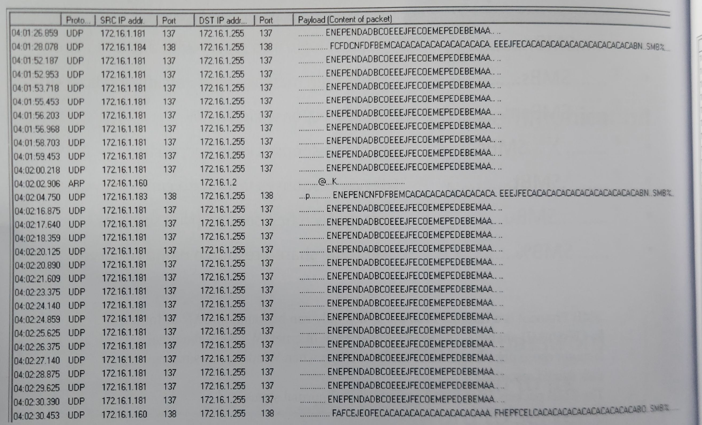
```
SMBr,SMBs,SMBu,SMB% 登入成功
```
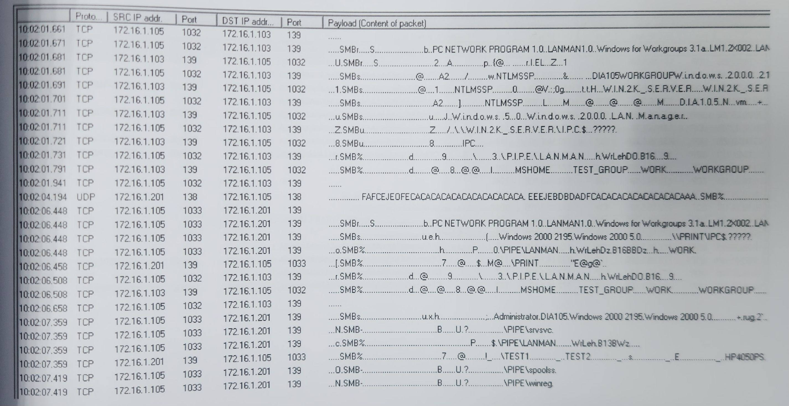
```
非廣播，是UDP的通訊
```
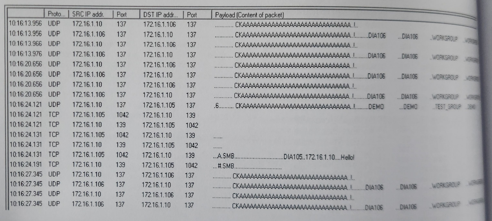
```
SMBsm 登入失敗
```
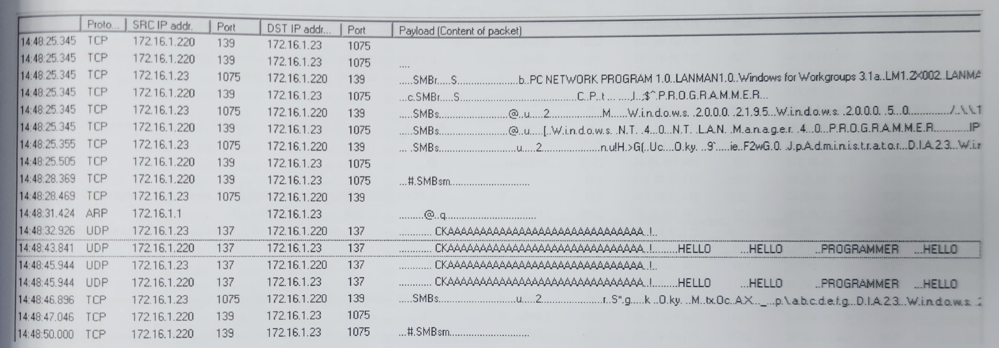
```
大量的 SMBr + SMBsm
Password Attack 三次登入失敗 
194.144.45.46 在進行密碼攻擊
```
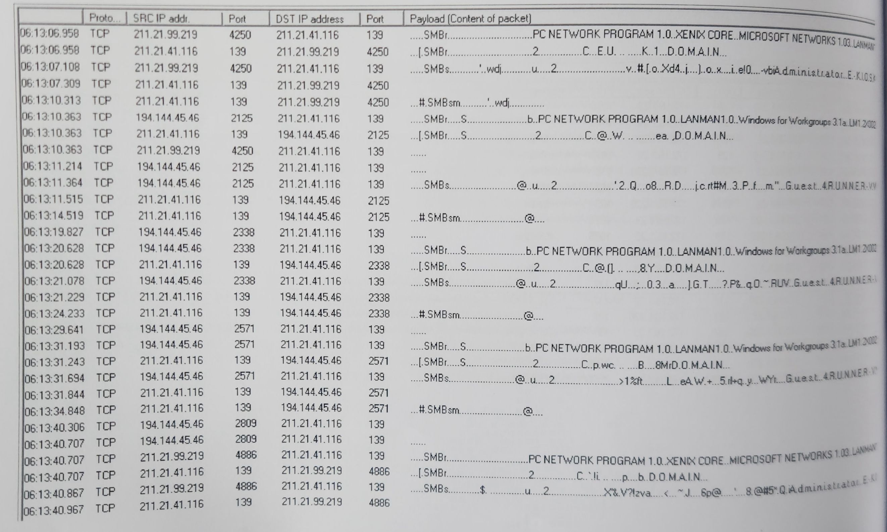


# SQL
Basic
```
MS-SQL   "TCP-1433",UDP-1434
MySQL    TCP-3306
Oracle   "TCP-1520,1521"
IBM-DB2  TCP-50000
Sybase   TCP-5000
```
```
使用1433，且payload中指令中間都有小數點(s.e.l.e.c.t)這個是Unicode兩個Byte當一個字用
```
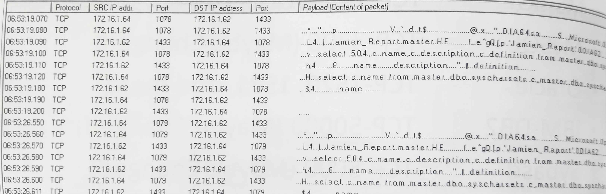
```
Port 1521 為 Oracle
```
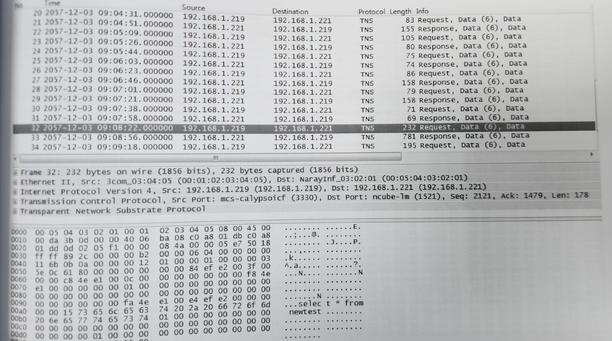
```
看見很多的Q(Command) T(Result)，PostgrSQL特徵 第一個Byte必為大寫英文字母
Payload中會有很多的簡寫'pg_'，而送出Q的必為Client端(10.23.196.194)
```
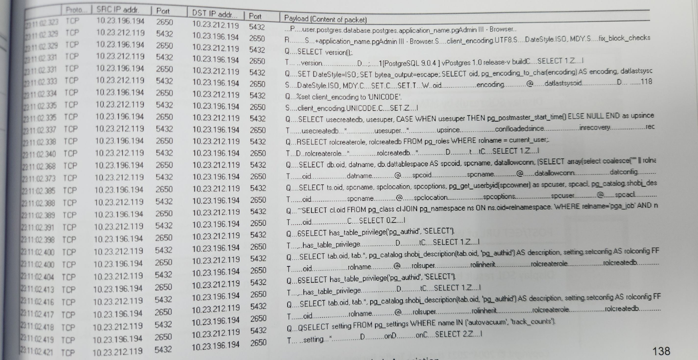
Basic
```
Telnet uses TCP-23 for default communication
```

# Telnet
Basic
```
Telnet uses TCP-23 for default communication
```

# FTP
Basic
```
FTP uses TCP-21 for default communication
```
```
CWD多次連續出現，屬於快速切換指令
Nessus弱掃一定會做這個嘗試
```
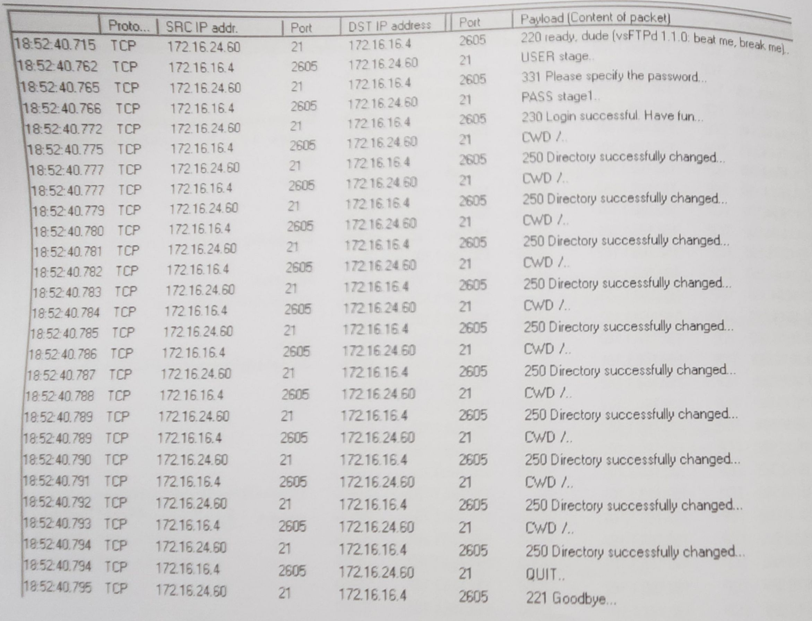
```
一堆AAAAAAAAAAAAAA buffer overflow
```
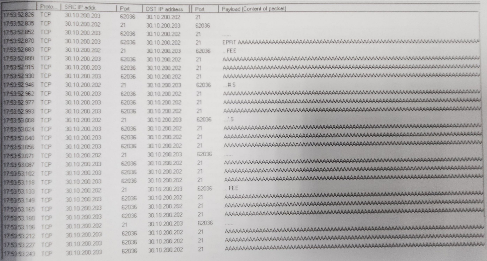


# SSH
```
封包均為加密內容，沒什麼好看的
```
```
少部分是明碼傳送，Hello階段是明碼傳送，多次出現 所以Password Attack
```
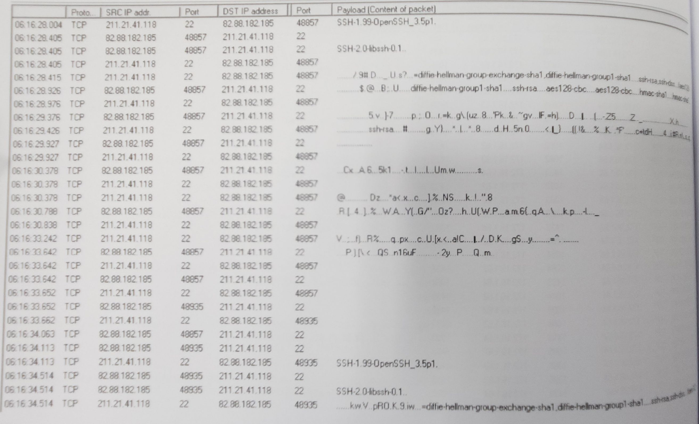

# Android
```
bcmls2.glpals.com 安卓專用的地圖公司
android.clients.google.com
```
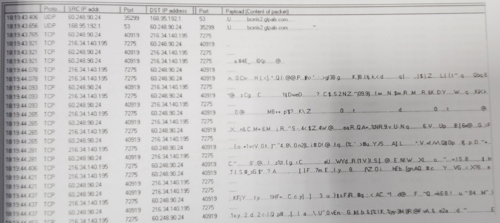

# UPnP
```
1900/UDP   SSDP 廣播端口
2869/TCP   Windows UPnP 設定服務（UPnP Host）
80/TCP	   HTTP

SSDP (Simple Service Discovery Protocol) 是 UPnP（通用隨插即用）架構的一部分
Payload 中會出現 UPnP, M-SEARCH, ssdp:discover, LOCATION, ST: 等字串
常用於網路家電、物聯網、IoT 設備使用
```
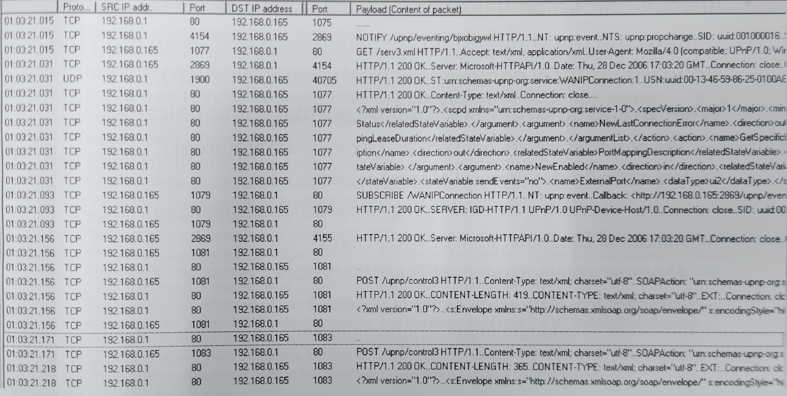