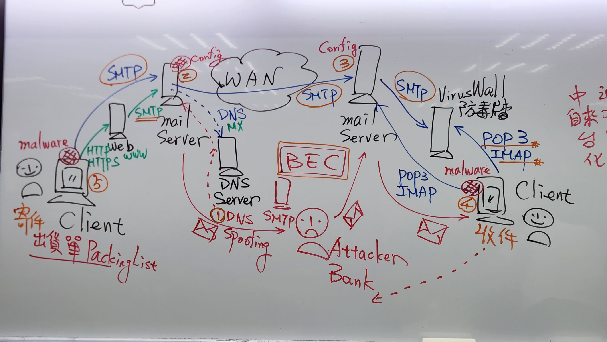
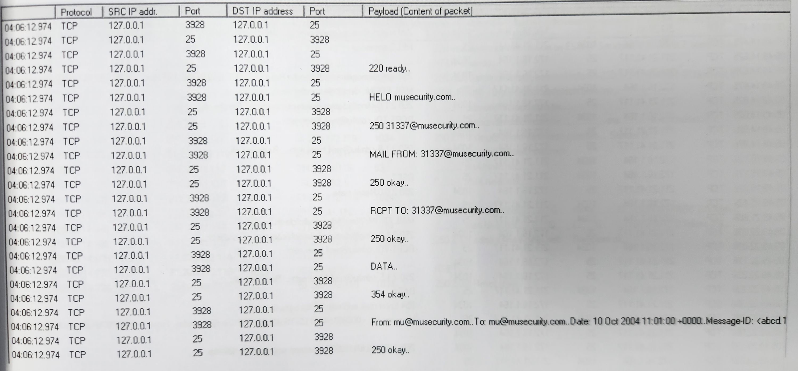
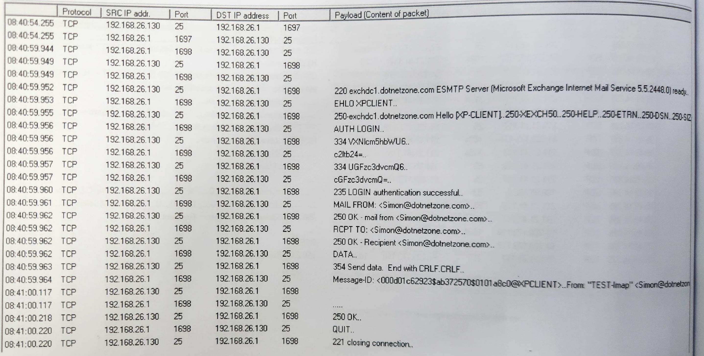
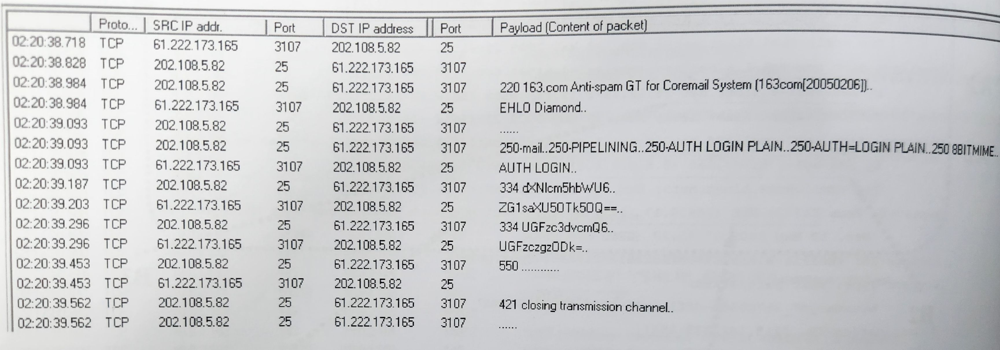
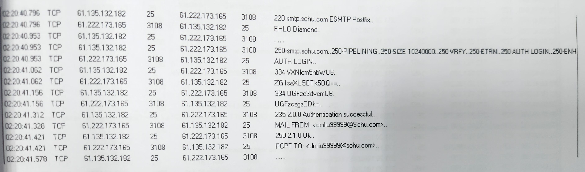
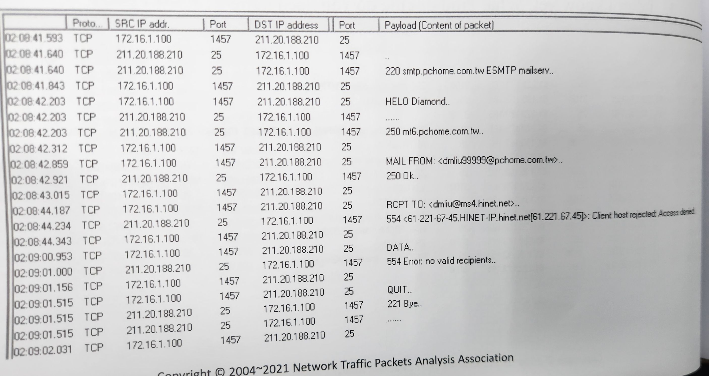
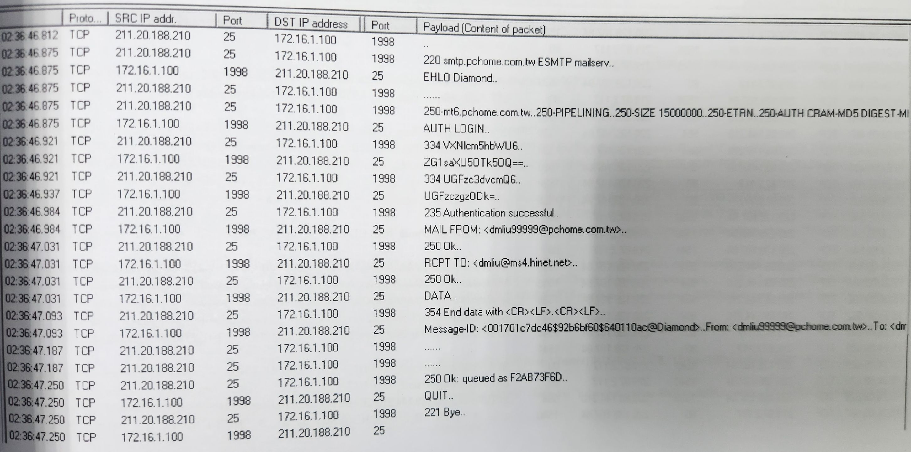
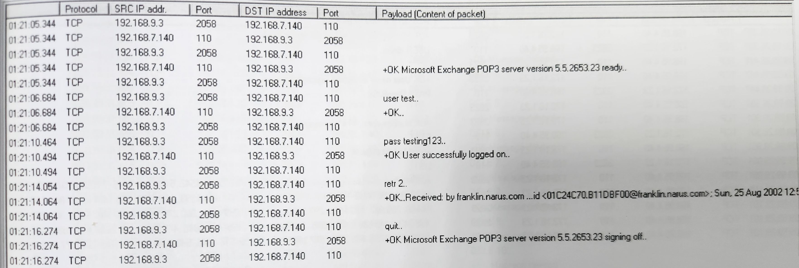
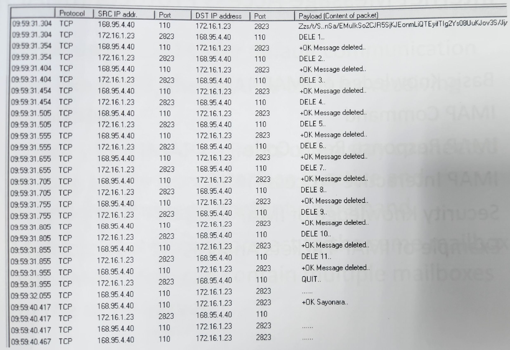

Email Services
===
🔙 [Packet Analysis](../README.md)

# Business Email Compromis


商業電子郵件入侵調查
1. DNS 欺騙 => DNS Spoofing
2. 設定轉寄功能 => Config
3. 接收端的SMTP被入侵 => Config
4. 收件端CLIENT被入侵 => Malware
5. 發送端的CLIENT被入侵 => Malware

退信攻擊法
- 偽冒寄件者 然後寄給一個不存在的收寄人 讓系統退信 讓目標寄件者去點擊這封退回來的信件

# SMTP
Basic
```bash
1. SMTP is uesd for sending email
2. SMTP uses TCP-25 for default communication
3. TCP-587 is also commonly used for client submission with STARTTLS encryption 
4. SMTP server also can be called the MTA (Mail Transfer Agent)
5. Web-Mail uses the Web Application(CGI) to access SMTP service for sending email.
   Therefore,it will use HTTP and SMTP both
```
Commands
```bash
HELO      : 用戶使用標準Hello
EHLO      : 用戶使用擴充(Extended)Hello，伺服器會回傳支援的功能(如 AUTH, SIZE, STARTTLS 等)
            使用EHLO絕對會把使用者的電腦名稱傳出去，可以錄封包驗證看看
            就算使用VPN也無法避免，除非更改電腦名稱或使用虛擬機寄件
            Outlook、Apple Mail	、手機內建郵件 App等目前都是使用EHLO
RCPT TO   : 收件人
MAIL FROM : 寄件人
DATA      : 信件內容，不包含信件的檔頭，在IR中DATA不算證據，因為駭客可以進行更改
QUIT      : client closes SMTP session
AUTH      : client sends mailbox account ID 
            常用 AUTH LOGIN，帳號與密碼以 Base64 編碼方式傳送，若未使用 STARTTLS 傳輸會有被攔截風險
PASS      : Client Send 憑證的雜湊值
VRFY      : 驗證某個電子郵件帳號是否存在於收件伺服器上 
EXPN      : 用來展開郵件群組（mailing list）或別名（alias），列出其所有實際收件人

2022 年前 OWASP 將 VRFY/EXPN 視為低風險項目，現在已移除，若依然偵測到應更新掃描引擎。
```
Response Rely Codes
```bash
1xx : preliminary reply (Initialize) 初始化狀態

2xx : completion rely (Sucessful status) 指令成功且被執行
220 : Server Hello Ready
250 : 指令執行成功，相當於HTTP 200

3xx : intermediate reply (sequence status) 指令可以但沒有被執行
334 : 是伺服器要求客戶端「提供驗證資料」的提示碼
354 : 傳送資料，Input繼續，通常<CRLF>作結尾，後面通常會補一個250

4xx : transient negative completion reply (none-action status) 指令執行起來發生錯誤

5xx : permanent negative completion reply (Game Over)嚴重的錯誤
502 : 命令不支援、不完全
550 : 你所要求的動作沒有執行 (帳號沒登入)
```







---


> 郵件伺服器可同時支援 POP3（台灣常見）與 IMAP（美國常見）協定，但用戶端通常選擇其中一種來存取郵件


# POP3
Basic
```bash
1. POP3 uses TCP-110 for default communication
2. POP3 是最早用來收電子郵件的協定之一，但一開始並不被廣泛接受
3. POP3 是下載型、離線處理
4. The response code of POP3 are '+' and '-'，不用特別管後面寫了什麼
    - '+' means OK
    - '-' means Not OK 
```
Command
```bash
USER : client sends mailbox account ID
PASS : client sends mailbox password
STAT : client asks how many items in mailbox
       只知道有多少封信，不知道寄件人是誰
LIST : receive back each mail size in mail server
RETR : retrieve the content of specific mail by number
       把信件收下來了
DELE : delete the specific number mail in server
       收信完後一定要把SERVER端的資料刪掉，要不然會重複收到
       POP3是類似FTP的概念
QUIT : client closes POP3 session
```



# IMAP
Basic
```bash
1. IMAP uses TCP-143 for default communication 也可使用加密版本 IMAPS TCP-993
2. 由史丹佛大學於 1986 年提出，比 POP3 更進階，Gmail 初期即支援(但預設關閉)
3. 支援多對多情境：一個人開多個信箱 / 一個信箱多人共用
   - 為此每個指令會加上命令編號（如 A0001）  
   - 用來對應伺服器的回應是哪個指令發出的  
       C: A0001 LOGIN user@example.com password  
       S: A0001 OK LOGIN completed

```
Commands
```bash
# IMAP 是1990後的新通訊協定概念，因應多裝置與頻寬提升，指令變長且支援同步與狀態管理。

CAPABILITY : Query the functions of IMAP service
             詢問SERVER支援什麼樣的命令
LOGIN      : Send user-name and password (NTLM/PASSWORD)
SELECT     : Change the folder of mailbox 切換目錄
LIST       : Receive each mail in mail server 表列清單，可以指定欄位
FETCH      : Receive the content of specific mail 把信件讀回來，似POP3的RETR
STARTTLS   : Use SSL for secure IMAP
             類似HTTPS進入加密狀態，有憑證或金鑰才有可能破解，金鑰相較起來是比較好得到的
LOGOUT     : Client closes IMAP session
```
Result Code
```bash
OK  command completed
NO  command error
BAD command unknow or arguments invalid
```