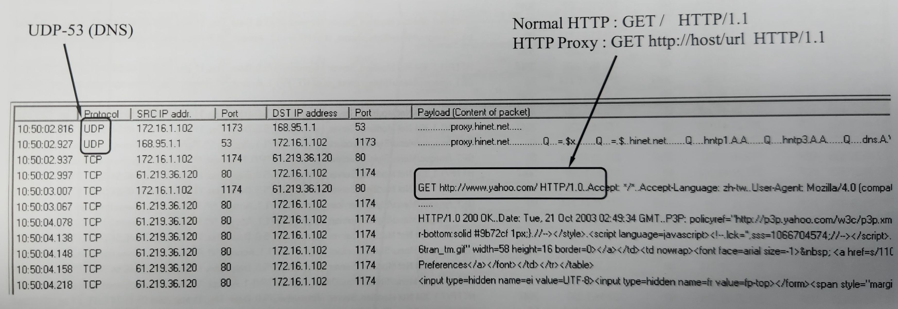
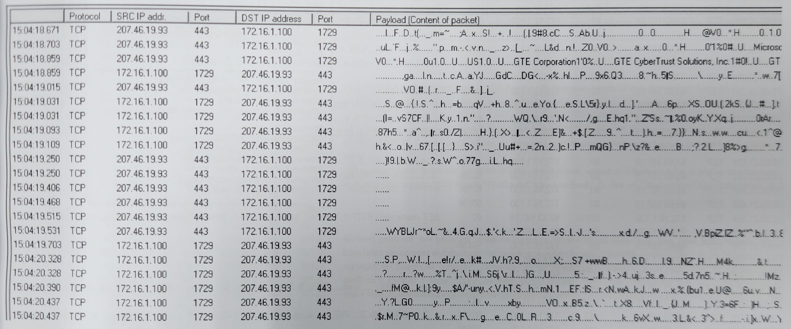

HTTP
===
🔙 [Packet Analysis](../README.md)

# HTTP Local Cache
```
出現304代表本地快取Local Cache，主機上本身有檔案快取，直接讀取
```

# HTTP Proxy
```
Normal HTTP : GET / HTTP/1.1                GET之後接網頁名稱
HTTP Proxy  : GET http://host/url HTTP/1.1  之後才接網站名稱
```

# HTTP SQL Injection - 1
```
GET 請求 + Status Code 500 + 找問號後面有沒有特殊符號字元
以上條件皆符合即為 SQL Injection
```

# HTTP SQL Injection - 2
# HTTP Download File
```
都是亂碼，不是被加密，就是被編碼，找明碼去觀察
出現206代表檔案很大量，可能是影片類型，所以會分段續傳

有UPLOAD目錄不一定代表在上傳，可以觀察到封包是從CLIENT位置發出
就可以判斷出目前的行為是在Download，也可以透過Wireshark的收發分析功能Tx < Rx來判斷出

USER-Agent:NSPLAYER 不是 Mozilla
MP4 : 有損壓縮法 LOSS COMPRESS
WMV : 無損
```

# HTTPS
```
全部都是亂碼是正常的，HTTPS不加密才不正常
```

# HTTP CGI SCAN - 1
```
除了第一個是GET，其他都是HEAD，回應都是404
大量探索不存在的網頁，判定為CGI SCAN 弱點掃描
```

```
通通都500，快速短時間的去QUERY
為 SQL Injection
```


# Port Scan - 1

# UPnP

# Port Scan - 2


# Worm Infection
```
類似Port Scan 但不是，是病毒Worm感染中毒
IP一直在變，但用固定的port跟不同的IP在連線
因為PORT程式碼裡面寫的是固定的，不知道目標有沒有開特定PORT
所以就一台一台去試，Port-135為RPC 

# 案例分享
https://unit42.paloaltonetworks.com/lucifer-new-cryptojacking-and-ddos-hybrid-malware/
QQMusic
```

