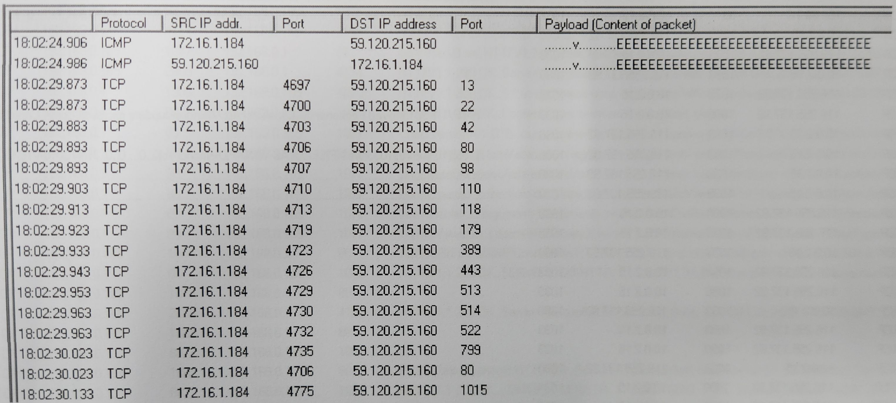
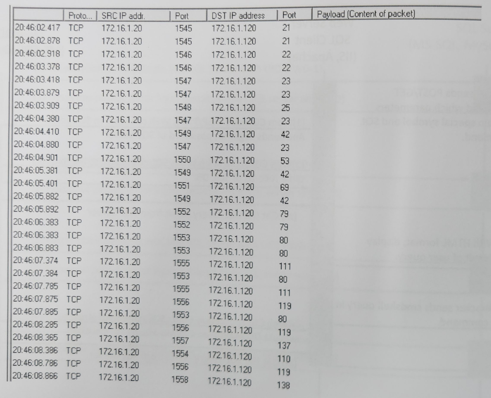

Other
===
🔙 [Packet Analysis](../README.md)

# Port Scan - 1

# Port Scan - 2


# Worm Infection
```
類似Port Scan 但不是，是病毒Worm感染中毒
IP一直在變，但用固定的port跟不同的IP在連線
因為PORT程式碼裡面寫的是固定的，不知道目標有沒有開特定PORT
所以就一台一台去試，Port-135為RPC 

# 案例分享
https://unit42.paloaltonetworks.com/lucifer-new-cryptojacking-and-ddos-hybrid-malware/
QQMusic
```

# UPnP
```
1900/UDP   SSDP 廣播端口
2869/TCP   Windows UPnP 設定服務（UPnP Host）
80/TCP	   HTTP

SSDP (Simple Service Discovery Protocol) 是 UPnP（通用隨插即用）架構的一部分
Payload 中會出現 UPnP, M-SEARCH, ssdp:discover, LOCATION, ST: 等字串
常用於網路家電、物聯網、IoT 設備使用
```
