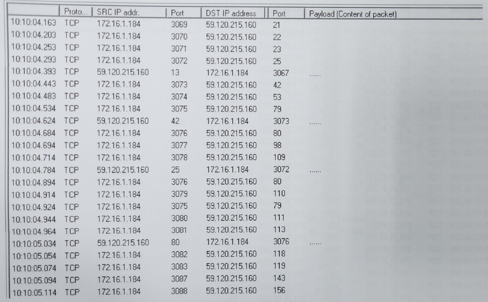
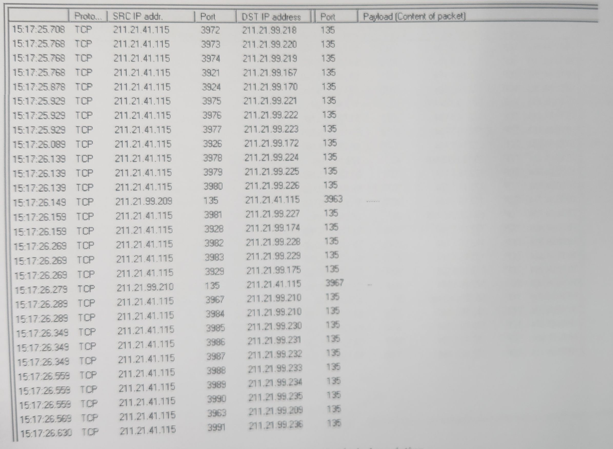

Special Situation
===
🔙 [Packet Analysis](../README.md)

# Port Scan - 1

# Port Scan - 2


# Worm Infection
```
類似Port Scan 但不是，是病毒Worm感染中毒
IP一直在變，但用固定的port跟不同的IP在連線
因為PORT程式碼裡面寫的是固定的，不知道目標有沒有開特定PORT
所以就一台一台去試，Port-135為RPC 

# 案例分享
https://unit42.paloaltonetworks.com/lucifer-new-cryptojacking-and-ddos-hybrid-malware/
QQMusic
```


# Trojan Proxy
```
Trojan Proxy跳板，同樣的內容接收端會馬上變成發送端
在幫人加轉封包，封包內容會一樣，但接收者會馬上變發送者 
```


# ARP Spoofing
```
封包內容也是一樣的但是因為是spoofing
同樣的封包會有不同的MAC去發送但IP都是一樣的
```
