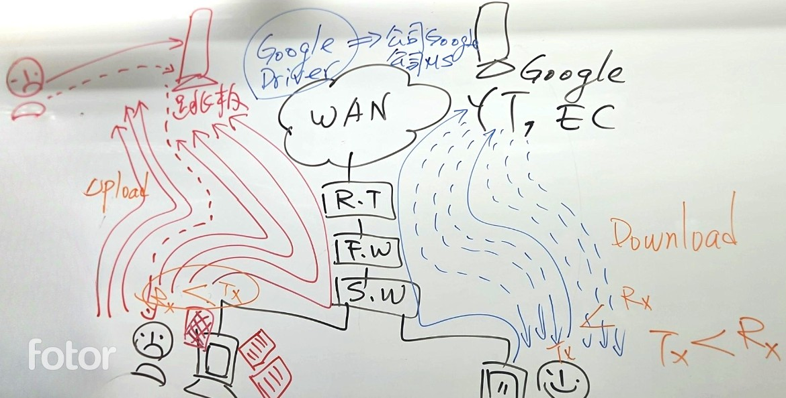

Basic
===
🔙 [Packet Analysis](../README.md)


# Configuration
View 
```bash
Open [ Packet Details ]
Open [ Packet Bytes ]
```

# Packet Color
錄完封包後首先我們先看右邊的封包顏色進行初步的分析
| 顏色 | 說明 |
|------|------|
| ⚪ 白色 | 一般封包，常見於第二層 Ethernet 封包，未套用特定協定色彩規則。 |
| 🔵 淺藍色 | UDP 封包，如 DNS、DHCP、mDNS 等。 |
| 🟣 藍紫色 | TLS/SSL 加密封包，內容加密，在沒有工具的前提下也無法直接解讀。 |
| 🟢 綠色 | HTTP 封包（明文傳輸），可直接觀察 GET/POST 等內容。 |
| 🔴 紅色 | 錯誤或異常封包，如 TCP RST（強制斷線）、TCP Retransmission（重傳）。 |
| 🟡 淺黃色 | NetBIOS Name Service，網路芳鄰相關封包。 |
| 🟧 鵝黃色（深黃偏橘） | ARP 封包（Address Resolution Protocol），區域網路內查詢/回應。 |
| ⚫ 黑底白字 | 傳輸異常封包，因TCP Flow Control，如 `TCP Dup ACK`、`ZeroWindow`、`Window Full` 等，代表網路問題可能存在。 |
| --- | --- |
| ⚫ 黑色 Barcode 條紋 | 表示封包接收不連續、流量中斷或網路不穩、可能丟包。 |


# Endpoint
- Statistics > Endpoint > IPv4  
- 從這邊去觀察封包的 [ 傳送:Tx ] 、 [ 接收:Rx ]
  - 正常來說用戶的行為皆為 [ 下載 ] : Tx < Rx ， 除非是在上傳文件至雲端硬碟
  - 使用這比較少見的行為是 [ 上傳 ] : Tx > Rx ， 排除那些可能會上傳到的網站(Google、Microsoft)，很大的機會就是駭客
  
- 從這邊去觀察封包的IP
  - 但IP的相關GEO資訊如果慢慢使用WHOIS的話太多太久了
  - [Maxmind GeoLite](https://dev.maxmind.com/geoip/geolite2-free-geolocation-data/) (關鍵字 : geoip free download)
  - GeoLite Country 下載**Binary**格式，Wireshark適用
  - 將圖資放在C槽底下，英文的資料夾內，解壓縮之後準備匯入
  - Edit > Perferences > Name Resolution > MaxMind database directories
  - **一定要點到最裡面的那層資料夾**，匯入後重新啟動Wireshark就可以看到後面有Geo圖資

# Filter
| | 欄位名稱  | 運算方式 | 資料 |
|---|---|---|---|
| 單項比較<br>Single Compare   | tcp.port<br>ip.addr  | ==  | 443,10.0.1200 |
| 多項比較<br>multiple Compare | ip.geoip.asnum  | in | {8075,15169}
| 內容比較<br>Content Compare  | tcp | contians(大小寫相異)<br>matches(大小寫相同) | "Hello"<br>"Select *"
```bash
{not ip.geoip.asum in{8075,15169,32934,99193462}) and tcp and tcp.flag.syn == 1
```
```bash
http contains "whoami"
http contains "eval("
http.request.method == "POST"
```

# HTTP
- Statistics > HTTP > Packet Counter
```bash
http or ssdp
# 有時候wireshark會誤判封包數量 因為ssdp跟http很類似會被誤判
# ssdp在packet counter中會被判定成SEARCH
```